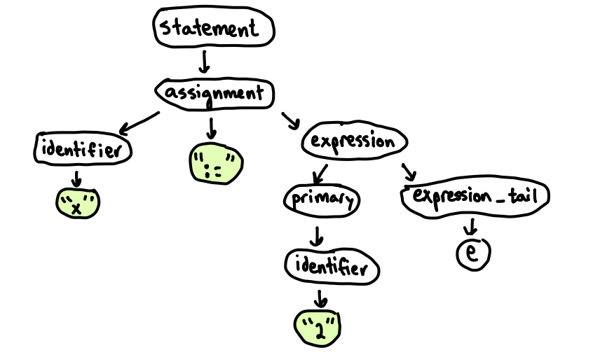
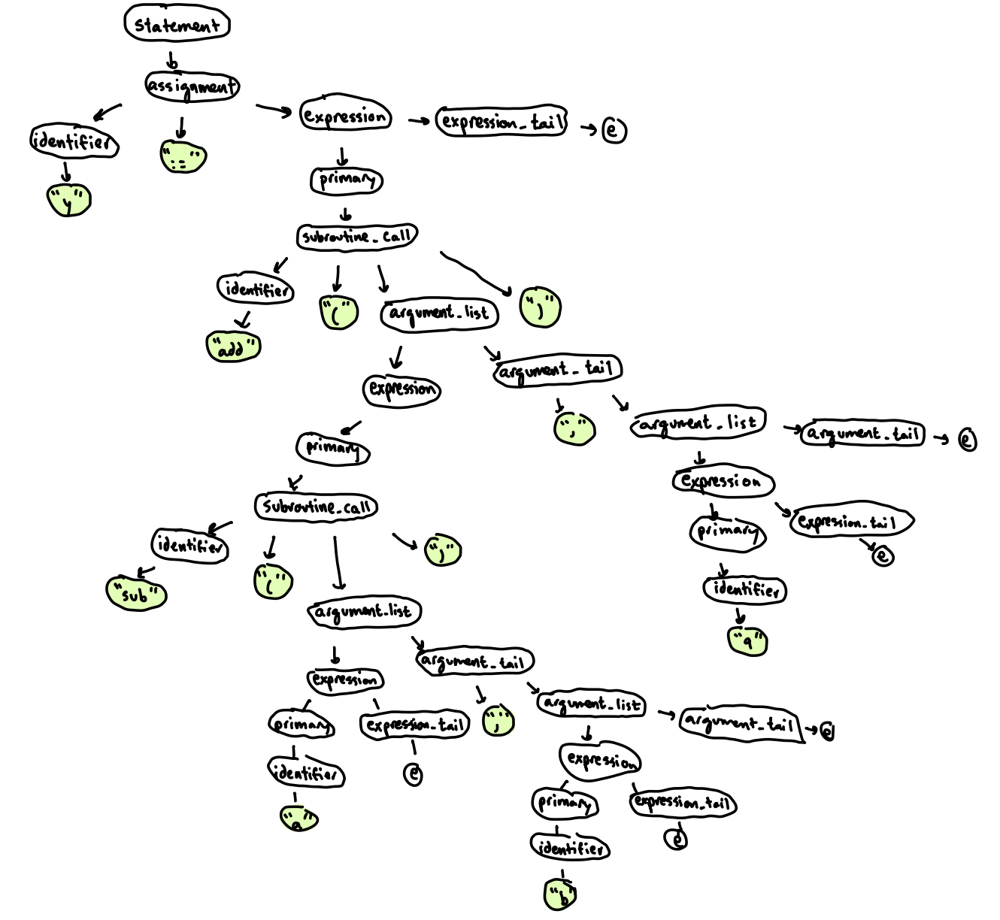
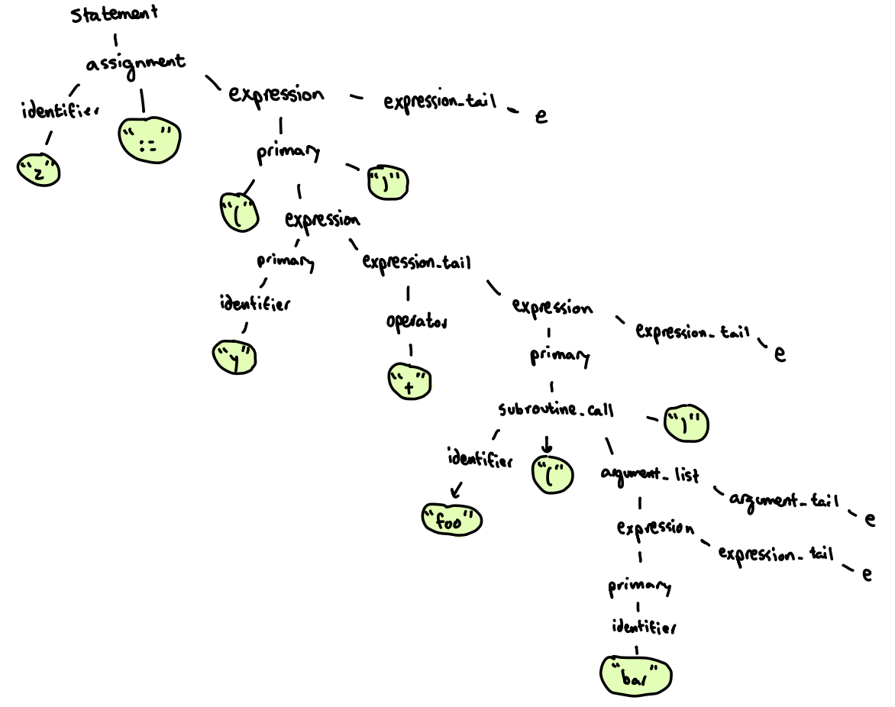
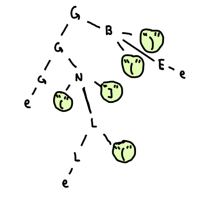
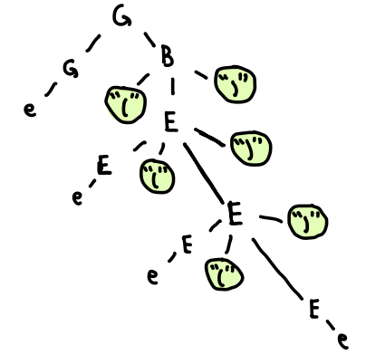

# CSE262 - Programming Languages - Spring 2023

# Homework 3 - Grammars and Parse Trees

**Due Date: 3/22/2023 by EOD**

**Be sure to make at least one commit per question!**

## Assignment

For this assignment you are to answer the following questions regarding grammars and parsers. Write answers to all of the questions in this README file. For parse trees, you may draw these by hand and scan them, draw them in powerpoint and make a picture, or make little ASCII trees as below:

```
Root
├ Parent1
│ ├ Child1
│ ├ Child2
│ │ └ GrandChild
│ └ Child3
└ Parent2
```
Whatever you do, make sure that you display these in your README. If it's a picture, embed it in the README with Markdown or HTML. e.g.

```html

```

## Questions

### Part 1 - Writing Grammars

Write a grammar in EBNF notation to capture the described language described. For each question, examples of valid and invalid strings in the grammar are given. There are more strings that may be valid or invalid, these are just examples. Your grammar must accept/reject these strings and others that meet the described parameters. For the invalid examples, explain what makes them invalid.

#### Question 1 - Strings in Rust. 

Strings begin and end with a quotation mark. Within the quotes are any number of charaters except double quote and backslash. Strings may contain quote or back-slash characters if and only if those are escaped by a preceding backslash.

Valid strings:

```
"hello world"
"abcdefg1234567!@#$%^"
"This is an escaped quote \" and an escaped backslash \\"
r#"This quote: " doesn't need to be escaped, nor does this backslash \"#
b"you can put a b in front to create a byte string"
br#"This one can have literal \ and " bytes without escapes"#
```

Invalid strings:

```
"hello -> There is no end quote
"they said "hello" " -> No escape sequence for double quote
"This \ that" -> No escape sequence for backslash
r#"Can't write a "# in the quoted text"# -> No escape sequence for double quote
```

**My Grammar:**
```
valid_string = '"', contents, '"';
contents = {(chars - '"') - '\' | '\"' | '\\'};
chars = \x20-7F;
```
#### Question 2 - Comments 

Comments are delimited by `/*` and `*/` or by `//`. Any character except a newline may follow a `//`. Any character can follow a `/*` unless that character is an asterisk `*` followed by a `/`.

Valid comments:

```
// inline comments can have any character including / and *
//this is valid
/* you can do a block like this on one line */
/* you can do a block \n on multiple lines */
```

Invalid comments:

```
/ not valid, -> Only 1 '/'
// not a\nvalid comment -> Cannot create a newline inside single-line comment
/* blocks need to be closed, so this is invalid -> No '*/' to close the comment
/* */ */ -> Closed the comment twice, which cannot happen
```

**My Grammar:** 
```
chars = \x20-7F;
valid_comment = singleline | block;
singleline = '//',{chars - '\n'}, '\n';
block = '/*', {chars - '*/'}, '*/';
```
#### Question 3 - E-mail addresses. 

Use this as a guide for how e-mail addresses are formatted: https://web.archive.org/web/20190302155016/http://www.huge.org/clapres/cla_4.html

Valid e-mail addresses:

```
hello@world.com
cim310@lehigh.edu
info@bbc.co.uk
```

Invalid addresses:

```
can't have spaces@gmail.com -> Invalid due to spaces in user
this.com -> No website for email (@*something*)
name@.com -> No website for email (@*something*)
```

**My Grammar:**
```
alpha = \x41-5A | \x61-7A;
numeric = \x30-39;
valid_address = user, '@', company, '.', org, ['.', country];
user = {alpha | numeric | '.' | '_' | '-'};
company = {alpha};
org = alpha, alpha, [alpha];
country = alpha, alpha;
```
#### Question 4 - Phone numbers

Use this as a guide for how phone numbers are formatted: https://en.wikipedia.org/wiki/National_conventions_for_writing_telephone_numbers#United_States,_Canada,_and_other_NANP_countries

Valid phone numbers:

```
555-555-5555
223-456-7890
(232) 384-9292
920.828.9482
```

Invalid phone numbers:

```
484.023.9378 -> Does not follow NPA-NXX-XXXX formatting, since the second N is 0
123-123-1234 -> Does not follow NPA-NXX-XXXX formatting, since both N are 1
5555555555 -> No separation or use of '-' or '.'
```

**My Grammar:**
```
connect = '.' | '-';
n = \x32-39;
x = \x30-39;
valid_number = area, n, x, x, connect, x, x, x, x;
area = ('(', n, x, x, ')',' ') | (n,x,x,connect);
```
#### Question 5 - Numeric constants 

These are binary, octal, decimal, hexadecimal, scientific.

- Binary numbers are prefixed with `0b` and contain the digits `0` and `1`. e.g. `0b01010110`
- Octal numbers are prefixed with `0o` and contain the digits `0` through `7`. e.g. `0o12345670`
- Decimal numbers have no prefix and contain the digits `0` through `9`. An optional period can be inserted to indicate a floating point constant. They can optionally be negative indicated by a preceding - sign. e.g. `1234567890` or `12345.67890`
- Hexadecimal number are prefixed with `0x` and contain the digits `0-9`, and the letters `A-F`. e.g. `0x1234567ABCDEF`
- Decimal constants can be written in scientific notation of the form: AeN (A times ten raised to the power of N), where the exponent N is an integer, and the coefficient A is any real number. The integer N is called the order of magnitude and the real number A is called the mantissa. e.g. `42.3e5` 

Optional underscores can be inserted into the middle of a number to improve readability. e.g. `1_000_000`

Valid numeric constants:

```
0b1010101
0o1643
0o1010101
456
4.56e2
3.14159
0xFFAA19
1_000
-123.456
-123
```

Invalid numbers:

```
0b123 -> 2 & 3 are not binary
0xABCDEFG -> G is not hex
FFAA12 -> No "0x" prefix
0o3.1415 -> Octal numbers cannot have decimals
_1000 -> Cannot start decimal # with '_'
0000000123 -> Decimal numbers don't start with '0' unless 0 <= number <= 1
-0b10101 -> Binary numbers can't be negated
```

My Grammar:
```
numeric = \x30-39;
valid_numeric_constant = bin | oct | dec | hex | scientific;

bin = "0b", {('0' | '1')};
oct = "0o", {(numeric - '8' - '9')};
dec = ['-'], numeric, {(numeric | '_')}, [numeric, '.', {numeric}];
hex = "0x", {numeric | 'A' | 'B' | 'C' | 'D' | 'E' | 'F'};
scientific = dec, 'e', {numeric};

```
## Part 2 - Parse Trees

### Question 6

Consider the following grammar:

`e` stands for the string terminating character (this allows us to satisfy a production rule arbitrarily. It's helpful in writing grammars for things like lists).

```ebnf
statement = assignment | subroutine_call;
assignment = identifier, ":=", expression;
subroutine_call = identifier, "(", argument_list, ")";
expression = primary, expression_tail;
expression_tail = operator, expression | e;
primary = identifier | subroutine_call | "(" , expression , ")";
operator = "+" | "-" | "*" | "/";
argument_list = expression, argument_tail;
argument_tail = "," , argument_list | e;
identifier = {a-z | A-Z | 0-9};
```

(For the following questions, you can ingnore whitespace)

1. Construct a parse tree for the input string "x := 2".



2. Construct a parse tree for the input string "y := add(sub(a,b),9)".



3. Construct a parse tree for the input string "z := 92 - (y + foo(bar))



### Question 7

Consider the following context-free grammar:

```ebnf
G = G, B | G, N | e;
B = "(", E, ")";
E = E, "(", E, ")" | e;
N = "(", L, "]";
L = L, E | L, "(" | e;
```

1. Describe in English the language generated by this grammar. What does this langauge does this grammar recognize? Hint: B stands for "balanced", N stands for "non-balanced".

This grammar recognizes when parentheses are balance (B), meaning that for a '(', there is a ')' somewhere else in the string corresponding to that parenthese. N is when that balance doesn't exist, and for B and N, there is E or L in-between the pairing, which will allow you to add more groupings like that.

2. Give a parse tree for the string "((]()".



3. Give a parse tree for the string "((()))".



## Assignment Instructions

1. Fork the relevant repository into your CSE 262 group namespace.

2. Clone your newly forked repository to your computer. Your repository should be hosted at 
```
https://gitlab.com/<your user name>-cse262/<assignment name>
```
You can use the following git command with the appropriate values substituted to customize it for you:
```
git clone https://gitlab.com/<your user name>-cse262/<assignment name>
```
3. Write the necessary code to answer all questions. After answering a question, commit your work. Follow the instructions [here](https://githowto.com/staging_and_committing) (read sections 6, 7 and 8) about staging and committing changes.

4. Push your work to the remote Gitlab servers using the `git push` command.

5. Check that your commits were successfully pushed to Gitlab.
